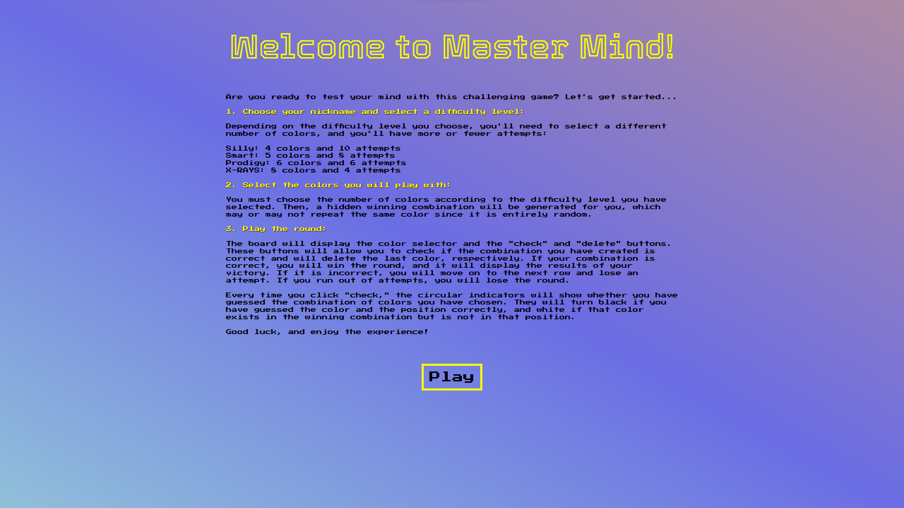
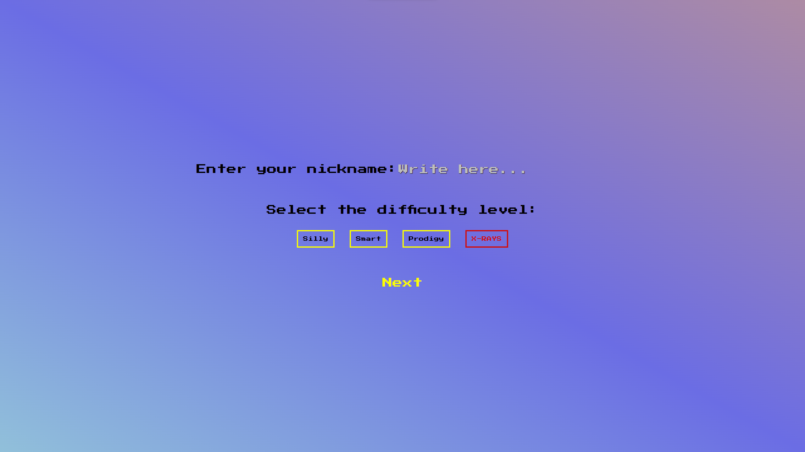
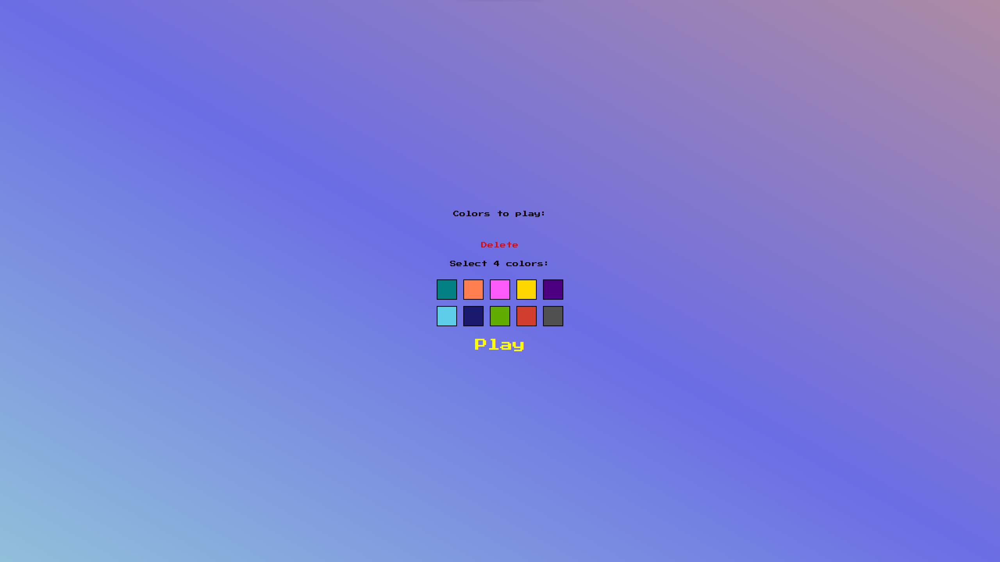
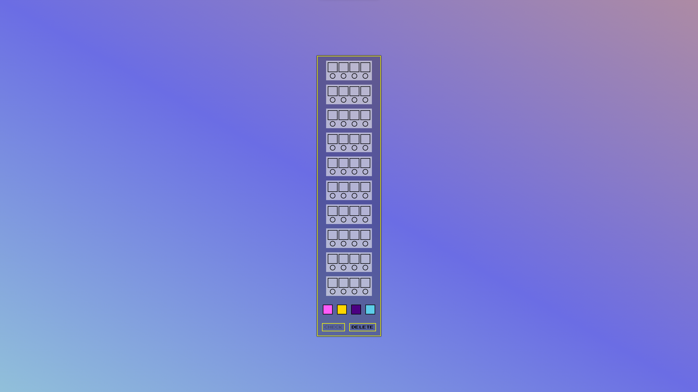
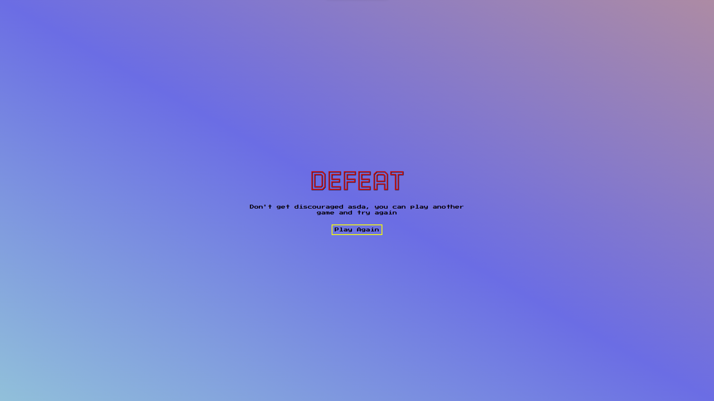

## - Repositorio del proyecto: https://github.com/Gaston-Valentini/proyect3-masterMind
## - Título: MASTER MIND
## - Desarrollador: Gastón Valentini
## - Descripción: Proyecto realizado en GeeksHubs Academy, se trata de la versión digital del juego de mesa Master Mind.
## - Objetivo: Demostrar los conocimientos adquiridos sobre maquetación con HTML y CSS y programación y manejo del DOM con JavaScript, algoritmos y lógica programática.
## Tecnologías utilizadas:
#### * HTML5 (Diseño general de la página)
#### * CSS3 (Se utilizó para dar estilos a la mayoría de los componentes, logrando un diseño responsivo mediante media queries)
#### * JavaScript (Se utilizó para darle interacción al usuario y funcionalidad al proyecto según los requisitos necesarios)
## - Estructura del proyecto: Además de este README.md, el proyecto consta de la siguiente estructura:
#### * index.html - index.css - index.js (Es el archivo principal del proyecto y a su vez es la vista inicial de la aplicación)

#### * Carpeta viewes (Contine carpetas de las diversas vistas con sus respectivos archivos CSS y JavaScript)
#### - Rules (Esta es la vista donde están explixcadas las reglas del juego y el funcionameinto de la aplicación)

#### - Difficulty (En esta vista el usuario podrá escoger su apodo y el nivel de dificultad de la partida)

#### - Colors (En esta vista el usuario deberá escoger los colores para la partida, según el nivel de dificultad)

#### - Play (Esta es la vista donde se dearrolla la partida, contiene el tablero y los controles de la partida)

#### - gameOver (Contiene los archivos con las vistas de victoria y de derrota)

#### * Carpeta de Audio e Images (Contienen los archivos multimedia del proyecto respectivamente)
## - Bugs conocidos:
#### * El sonido de la aplicación no se reproduce automáticamente debido a que los navegadores modernos tienen políticas de reproducción automática de medios para mejorar la experiencia del usuario y evitar molestias, como la reproducción automática de sonidos no deseados.
#### * La aplicación puede fallar si no se sigue el flujo natural de la misma y se retrocede en el navegador, debido a la naturaleza con la que está desarrollada la aplicación y su relación con el localStorage.